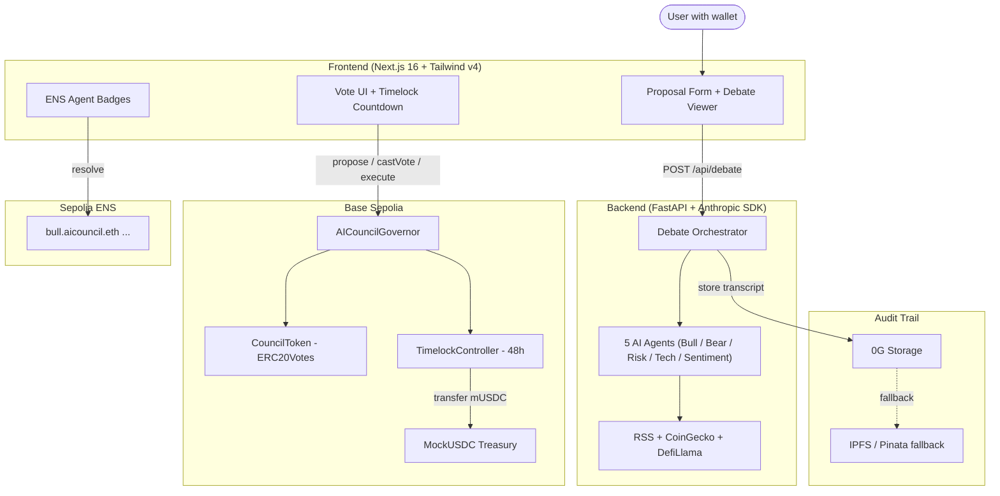

# AI Treasury Council

> 5 specialized AI agents debate every DAO treasury decision. Source-cited reasoning. Immutable audit trail on 0G Storage. On-chain governance via OpenZeppelin Governor on Base Sepolia.

[](LICENSE)
[](https://ethglobal.com/events/agents)
[](https://sepolia.basescan.org)

**[Architecture](#architecture)** | **[Smart Contracts](#smart-contracts)** | **[Sponsor Integrations](#sponsor-integrations)** | **[Setup](#setup)** | **[Testing](#testing)** | **[Glossary](docs/glossary.md)**

## The Problem

DAOs hold $26B+ in treasury assets, but governance suffers from voter apathy and decision concentration. A single whale can push through a 100k USDC allocation while 90% of token holders abstain. No structured analysis. No one plays devil's advocate, and the reasoning behind decisions disappears.

## What AI Treasury Council Does

Submit a treasury proposal (e.g. "Allocate 100k USDC to Aave for yield"). Five AI agents analyze it from different angles:

| Agent | Role | Bias |
|-------|------|------|
| **Bull** | Growth opportunities | Optimistic |
| **Bear** | Downside risks | Skeptical |
| **Risk** | Quantitative risk/reward | Neutral |
| **Tech** | Smart contract safety | Security-first |
| **Sentiment** | Community + market mood | Data-driven |

Each agent cites its sources (RSS feeds, CoinGecko, DefiLlama) with confidence weights. The full debate transcript is stored immutably on **0G Storage**. Token holders then vote on-chain via OpenZeppelin Governor with a 48-hour timelock before execution.

**Try it:** [TBD - deployed Sun 3.05](https://demo.aitc.app) | **Watch demo:** [3-min video](https://youtube.com/TBD)

> New to blockchain governance? See the [Glossary](docs/glossary.md) for plain-English definitions.

## Sponsor Integrations

### 0G Labs - Immutable Audit Trail

Every debate transcript (agent decisions, sources, confidence scores, consensus) is uploaded to **0G Storage** after each council session. The content-addressed hash is available on-chain for verification. Automatic fallback to IPFS if 0G is unreachable.

- Storage layer: `apps/api/storage/` (factory pattern with 0G primary + IPFS fallback)
- See [FEEDBACK.md](FEEDBACK.md) for detailed developer experience feedback

### ENS - Agent Identity via NameStone Subnames

Each of the 5 agents gets an ENS subname under `aicouncil.eth` (e.g. `bull.aicouncil.eth`, `bear.aicouncil.eth`). Subnames are minted via NameStone API with text records for agent role and historical accuracy.

- Frontend resolves subnames via viem ENS utilities
- See [FEEDBACK.md](FEEDBACK.md) for detailed developer experience feedback

## Architecture

User submits proposal -> 5 agents debate with cited sources -> transcript stored on 0G -> user votes on-chain -> 48h timelock -> treasury action executes.



## Tech Stack

| Layer | Technology |
|-------|-----------|
| **Frontend** | Next.js 16, Tailwind CSS v4, shadcn/ui, RainbowKit, wagmi v2, viem |
| **Backend** | Python 3.11+, FastAPI, Anthropic SDK (Claude) |
| **Smart Contracts** | Solidity 0.8.24, Foundry, OpenZeppelin Contracts v5 (Governor, ERC20Votes, TimelockController) |
| **Storage** | 0G Storage (primary audit trail), IPFS via Pinata (automatic fallback) |
| **Data Sources** | RSS news feeds (Reuters, CoinDesk), CoinGecko API, DefiLlama API |
| **Chain** | Base Sepolia testnet |
| **CI/CD** | GitHub Actions (lint + test + gitleaks), Vercel (frontend), Railway (backend) |

## Smart Contracts

All contracts deployed on **Base Sepolia** (2026-05-02). Based on OpenZeppelin Contracts v5 via Wizard.

| Contract | Address | Role |
|----------|---------|------|
| **CouncilToken** | [`0x5fE2...4381`](https://sepolia.basescan.org/address/0x5fe2a5e971d9faaff9cc0b0c9981da44fefc4381) | ERC20Votes governance token (AICT). Timestamp-based clock mode. |
| **TimelockController** | [`0x76A6...1B0f`](https://sepolia.basescan.org/address/0x76a69bb6aef69a2e76fa6c9632ff6ca101441b0f) | 48-hour delay before execution. Admin revoked - fully decentralized. |
| **AICouncilGovernor** | [`0x1f95...01F0`](https://sepolia.basescan.org/address/0x1f95c796c5dc47d08b20cf3220a2afa995e301f0) | Governor with 60% quorum, 1-day voting, 0 proposal threshold. |
| **MockUSDC** | [`0x606E...59d`](https://sepolia.basescan.org/address/0x606ede7755131e6206a29b67d88761eebb3bb59d) | Testnet stablecoin (mUSDC, 6 decimals). 1M minted to Timelock treasury. |

**Governance parameters:** voting delay 1 block (~12s) -> 1-day voting period -> 48h timelock -> execution.

Pre-deploy security audit: 0 CRITICAL, 0 HIGH findings. 23/23 Foundry tests PASS.

## Trust Mechanisms

Five mechanisms ensure AI council decisions are transparent and verifiable:

**1. Source Attribution per Claim**
Every agent statement includes cited URLs (RSS, CoinGecko, DefiLlama) with confidence weights (0.0 - 1.0). No black-box recommendations - users can verify every claim.

**2. Timelock Countdown UI**
48-hour delay between vote passing and execution. The frontend displays a live countdown so any token holder can review, challenge, or veto before funds move.

**3. Immutable Audit Trail (0G Storage)**
The full debate transcript (all 5 agent opinions, sources, confidence scores) is stored on 0G Storage with a content hash recorded on-chain. Past debates are retrievable and tamper-proof.

**4. ENS Reputation Badges**
Each agent has an ENS subname (e.g. `bull.aicouncil.eth`) with on-chain text records tracking historical accuracy. Agents build reputation over time.

**5. Human-in-the-Loop Council Rules**
A JSON config defines which proposal types require human override (e.g. transfers above threshold, new protocol integrations). AI advises, humans decide.

## Setup

### Prerequisites

- Node.js 20+ and pnpm
- Python 3.11+
- Foundry (`curl -L https://foundry.paradigm.xyz | bash && foundryup`)

### Install and run

```bash
git clone https://github.com/danergXx-xX/ETH-Global ai-treasury-council
cd ai-treasury-council

# Copy env template and fill in your keys
cp .env.example .env
# Required: ANTHROPIC_API_KEY, BASE_SEPOLIA_RPC_URL, DEPLOYER_PRIVATE_KEY
# Optional: ZERO_G_STORAGE_KEY, NAMESTONE_API_KEY, COINGECKO_API_KEY

# Install dependencies
pnpm install

# Start frontend (terminal 1)
pnpm dev  # http://localhost:3000

# Start backend (terminal 2)
cd apps/api && uvicorn main:app --reload  # http://localhost:8000

# Local chain for testing (terminal 3)
cd contracts && anvil  # http://localhost:8545
```

### Verify it works

```bash
# Health check
curl http://localhost:8000/health

# Submit a test debate
curl -X POST http://localhost:8000/api/debate \
  -H "Content-Type: application/json" \
  -d '{"text": "Allocate 50k USDC to Aave V3 for yield optimization"}'
```

## Testing

120+ tests across three layers:

| Layer | Framework | Tests | Command |
|-------|-----------|-------|---------|
| **Smart Contracts** | Foundry | 23 | `cd contracts && forge test` |
| **Backend API** | pytest | 97 | `cd apps/api && python -m pytest` |
| **E2E + Integration** | Playwright | 3 specs | `npx playwright test` |

**Smoke test checklist** (pre-deploy):
- `curl /health` returns `{"status":"ok"}`
- `POST /api/debate` returns 5 agent decisions + consensus
- Frontend loads at `:3000` with wallet connect
- Contract interactions work on Base Sepolia (propose, vote, queue, execute)

## How We Built It

Two-person team (Dan + Matthew) with a 15-agent AI dev-team orchestrated through Claude Code over a 3-day sprint. Dan directed architecture decisions and managed agent coordination. Matthew provided the phased MVP plan, demo voice-over, and sponsor feedback.

The AI agents handled specialized work: Sol for Solidity contracts, Hugo for FastAPI backend, Aiko for Next.js frontend, Nova for debate orchestration, Quill for testing. Every commit went through automated code review (Critic agent) and security audit (Mateusz agent) before merge.

Key architectural decisions: OpenZeppelin Wizard for contracts (battle-tested, no custom Solidity), 0G Storage as primary with IPFS fallback (resilience), and source attribution baked into the agent schema from day one (not bolted on).

## Team

- **Dan Otomanski** ([@danergXx-xX](https://github.com/danergXx-xX)) - Lead, AI orchestration, system design
- **Matthew Foyle** - Architecture plan, demo voice-over, FEEDBACK.md
- **15-agent dev-team** - AI agents for PM, engineering, QA, security, and docs

## License

MIT - see [LICENSE](LICENSE)
