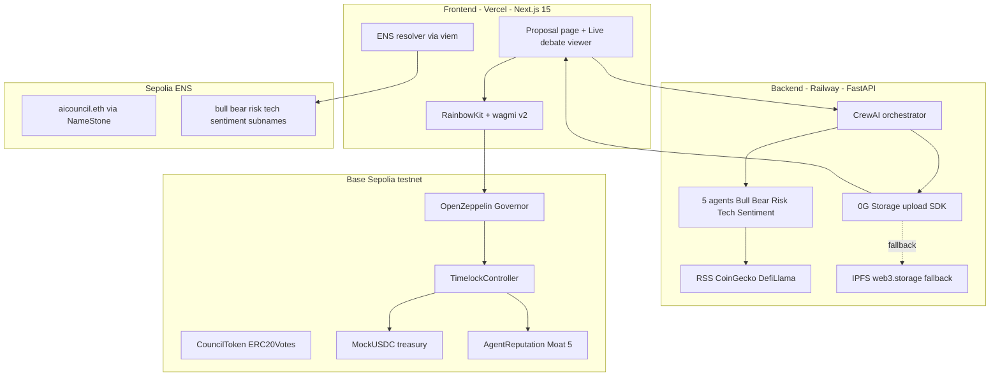

# AI Treasury Council

> **Multi-agent AI Council dla DAO treasuries.** 5 wyspecjalizowanych agentow debatuje kazda decyzje treasury (Bull/Bear/Risk/Tech/Sentiment), z on-chain audit trail (0G Storage), ENS subnames per agent z reputation, i Proof-of-Work for agents (incentive system).

**ETHGlobal Open Agents 2026 Hackathon Project** | Deadline: 2026-05-03 18:00 PL

[](LICENSE)
[](https://ethglobal.com/events/agents)

---

## Co to jest (30 sec read)

DAO maja $26B w treasury, ale governance cierpi na voter apathy + decision concentration. **AI Treasury Council** deploys 5 specjalizowanych AI agentow ktorzy debatuja kazde proposed treasury action - z cytowanymi zrodlami, full reasoning na lancuchu, i on-chain reputation per agent.

**Try it:** TBD (deployed Niedz 3.05) | **Watch demo:** TBD (3-min video)

---

## Architektura (high-level)



---

## Quick start (developers)

### Prerequisites

```bash
# Node 20+ (mamy 25.8 OK)
node --version

# Python 3.11+ (mamy 3.14 OK)
python3 --version

# pnpm
brew install pnpm

# Foundry
curl -L https://foundry.paradigm.xyz | bash
foundryup
```

### Setup

```bash
git clone https://github.com/danergXx-xX/ETH-Global ai-treasury-council
cd ai-treasury-council

# Skopiuj env i wypelnij secrets (NIE commit!)
cp .env.example .env
# Edytuj .env: ANTHROPIC_API_KEY, BASE_SEPOLIA_RPC_URL, DEPLOYER_PRIVATE_KEY...

# Install deps
pnpm install

# Run dev (3 procesy)
pnpm dev          # Frontend on :3000
# (osobny terminal)
cd apps/api && uvicorn main:app --reload  # Backend on :8000
# (osobny terminal)
cd contracts && anvil  # Local Ethereum on :8545
```

### Test (Phase 0 smoke)

```bash
# Backend health
curl http://localhost:8000/health

# Submit test proposal
curl -X POST http://localhost:8000/api/debate \
  -H "Content-Type: application/json" \
  -d '{"proposal": "Allocate 100k USDC to Aave for yield"}'
```

---

## Co nas wyroznia (5 moats)

1. **0G Compute Verifiable AI** (Phase 3 stretch) - wybrany agent inference verifiable on-chain
2. **Source-attributed decisions** - kazdy claim agenta cytuje URL + confidence score (Perplexity model)
3. **0G Storage immutable audit trail** - cala debata zapisana decentralized z hash on-chain
4. **ENS subnames z live reputation** - 5 agentow z .eth nazwami + dynamic text records
5. **Proof-of-Work for agents** (Matthew unique spin) - on-chain reputation system, incentivizes good behavior, slashes bad actors

---

## Sponsor integrations

- **0G Labs** ($15k pool) - Storage (MVP) + Compute (Phase 3 stretch)
- **ENS** ($5k pool) - 5 agent subnames live-resolved + ERC-8004 profile
- **ETHGlobal Finalist** ($20k) - automatyczna eligibility
- **Cuts ze scope:** KeeperHub (docs login), Uniswap v4 (cutting-edge), Aave (scope creep)

---

## Documentation

- [Architecture deep-dive](docs/architecture.md) - dla developerow
- [DAO governance flow](docs/governance.md) - dla DAO contributorow
- [Glossary](docs/glossary.md) - dla sedziow (terminy non-tech)
- [API reference](docs/api.md) - OpenAPI / Swagger
- [Smart contracts](docs/contracts.md) - addresses, ABI, NatSpec
- [Roadmap](docs/roadmap.md) - post-hackathon plans

---

## Security

This is a hackathon project deployed on **Base Sepolia testnet only**. **Do not use in production with real funds.**

Found a vulnerability? Email: dan.otomanski@danergy.pl

Smart contracts are based on OpenZeppelin Wizard templates (Governor + ERC20Votes + Timelock).
No mainnet deployments. Deployer keys are testnet-only and rotated post-hackathon.

### Disclaimers
- AI agent decisions are advisory only - DAO governance has final say
- No financial advice
- Code provided as-is, MIT License

---

## Team

- **Dan Otomanski** ([danergXx-xX](https://github.com/danergXx-xX)) - Lead, AI orchestration, build
- **Matthew Foyle** - Plan + advisor, demo voice-over, FEEDBACK.md drafting
- **15-agent dev-team** - Software house infrastructure (PM, Quality, Engineering, Comms layers)

---

## License

MIT - see [LICENSE](LICENSE)
