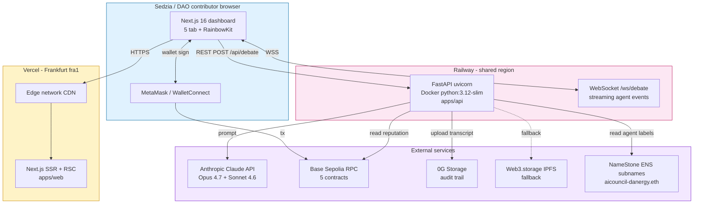

# Phase 4 Production Deploy - Summary

**Sprint:** ETHGlobal Open Agents 2026
**Phase:** 4 (production deploy + sedziowski demo)
**Owner:** Rio (DevOps)
**Status:** infrastructure ready, awaiting Dan CLI auth + first deploy

---

## Live URLs (post-deploy fill-in)

| Warstwa | URL produkcyjny | Status |
|---|---|---|
| **Frontend (Vercel)** | https://aitc.vercel.app | placeholder - first `vercel --prod` |
| **Backend (Railway)** | https://aitc-api.up.railway.app | placeholder - first `railway up` + `railway domain` |
| **Sedziowie ETHGlobal** | https://aitc.vercel.app | jeden URL do przeklikania |

Po pierwszym deploy - zaktualizuj rzeczywiste URL w tym pliku + w `scripts/PRODUCTION-DEPLOY-RUNBOOK.md`.

---

## Smart contracts (Base Sepolia, juz live)

| Kontrakt | Adres | Basescan |
|---|---|---|
| AICouncilGovernor | `0x1F95c796C5DC47d08B20cf3220a2AFa995E301f0` | https://sepolia.basescan.org/address/0x1F95c796C5DC47d08B20cf3220a2AFa995E301f0 |
| CouncilToken (ERC20Votes) | `0x5fe2a5e971D9faaff9cC0b0c9981DA44fEFC4381` | https://sepolia.basescan.org/address/0x5fe2a5e971D9faaff9cC0b0c9981DA44fEFC4381 |
| TimelockController (48h) | `0x76a69bB6AeF69A2E76Fa6C9632FF6Ca101441b0f` | https://sepolia.basescan.org/address/0x76a69bB6AeF69A2E76Fa6C9632FF6Ca101441b0f |
| MockUSDC (treasury asset) | `0x606EdE7755131e6206a29B67d88761EEbb3Bb59d` | https://sepolia.basescan.org/address/0x606EdE7755131e6206a29B67d88761EEbb3Bb59d |
| AgentReputation (Moat 5) | `0xf3BAb9A2761131f4A9e5BA2d9e6395bea2186f44` | https://sepolia.basescan.org/address/0xf3BAb9A2761131f4A9e5BA2d9e6395bea2186f44 |

Wszystkie verified na Basescan. Audit pre-deploy: Mateusz APPROVE (0 CRITICAL/HIGH), Critic 8.5/10, Vera 8.5/10, 23/23 Foundry tests PASS.

---

## Architecture (production)



---

## Stack production

### Frontend (Vercel)
- **Framework:** Next.js 16.2.4 + React 19.2.4
- **Build:** pnpm + Turbopack
- **Web3:** wagmi 2.19 + viem 2.48 + RainbowKit 2.2
- **UI:** Tailwind v4 + shadcn/ui (radix-ui)
- **Region:** fra1 (Frankfurt - bliskie sedziowie EU)
- **Headers:** X-Frame-Options DENY, X-Content-Type nosniff, Referrer strict-origin
- **Free tier:** unlimited deployments, 100 GB bandwidth/mo

### Backend (Railway)
- **Framework:** FastAPI 0.115 + uvicorn 0.32 (proxy-headers ON)
- **Python:** 3.12-slim, multi-stage Docker build
- **Image size:** ~180 MB runtime (lxml + cryptography slim)
- **Healthcheck:** `/health` (Docker HEALTHCHECK + Railway native)
- **Restart policy:** ON_FAILURE max 3 retries
- **Free tier:** $5 credit/mo (sufficient dla sprintu + sedziowski demo)
- **User:** non-root `app` (security baseline)

### Smart contracts (Base Sepolia)
- **Solidity:** 0.8.x + OpenZeppelin v5
- **Framework:** Foundry
- **Verified:** wszystkie 5 na Basescan
- **Status:** live, deployer 0x4872...148a, ~0.0001 ETH gas

---

## Sedziowski entry point (3-min)

1. **Open** https://aitc.vercel.app
2. **Connect Wallet** (MetaMask z Base Sepolia, faucet: alchemy.com/faucets/base-sepolia)
3. **Read** dashboard 5 tab: Live Debate, Proposals, Audit Trail, Source Attribution, ENS Identity
4. **Submit Proposal:** wpisz "Allocate 50k mUSDC to defi yield strategy" -> "Start Debate"
5. **Watch** WebSocket streaming: 5 agents (bull/bear/risk/tech/sentiment) live debata + consensus
6. **Click** Audit Trail tab -> 0G Storage CID + transcript link
7. **Click** ENS Identity -> 5 personas z subnames + on-chain reputation
8. **Demo Mode:** dodaj `?demo=fast` do URL aby skipowac 48h timelock countdown

---

## Smoke test commands (post-deploy)

```bash
# Backend
curl -fsS https://aitc-api.up.railway.app/health | jq
curl -fsS https://aitc-api.up.railway.app/api/agents/reputation/all | jq

# WebSocket
echo '{"text":"test"}' | websocat wss://aitc-api.up.railway.app/ws/debate

# Frontend
curl -I https://aitc.vercel.app                    # 200 OK
curl -fsS https://aitc.vercel.app | grep -o "<title>.*</title>"
```

---

## Deploy artifacts (this PR)

- `apps/api/Dockerfile` - multi-stage python:3.12-slim build
- `apps/api/.dockerignore` - excludes tests/.env/__pycache__
- `apps/web/vercel.json` - framework + buildCommand pnpm + security headers
- `railway.json` (root) - Dockerfile build + healthcheck + restart policy
- `scripts/PRODUCTION-DEPLOY-RUNBOOK.md` - Dan operational guide
- `docs/PHASE4-DEPLOY-SUMMARY.md` - this file

---

## Open items dla post-Phase 2 ENS merge

Gdy Sesja 25 (Sol+Aiko Phase 2 ENS) merguje:
1. Aktualizuj `NEXT_PUBLIC_ENS_DOMAIN` na rzeczywisty issued domain (jesli inny niz `aicouncil-danergy.eth`)
2. `vercel --prod` redeploy frontend (1 klik)
3. Potencjalnie dodaj 5 ENS subnames per agent jako dane displayed w ENS Identity Card

---

## Status: ready_for_dan_cli_auth

Cala infrastruktura skonfigurowana. Dan musi:
1. CLI install + login (5 min - Vercel + Railway + WalletConnect signup)
2. Set env vars (10 min - copy-paste z RUNBOOK CZESC A.2 + B.2)
3. First deploy (5 min - `vercel --prod` + `railway up`)
4. Update URL placeholders w tym pliku (1 min)
5. Smoke test (2 min - curl + browser klik)

Total: ~25 min od zera do live.
