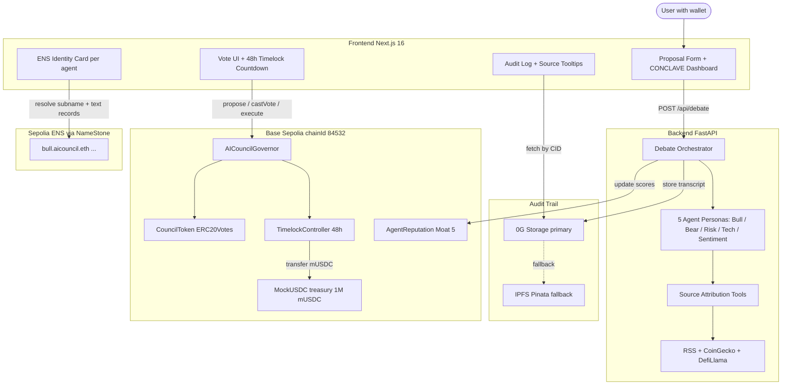
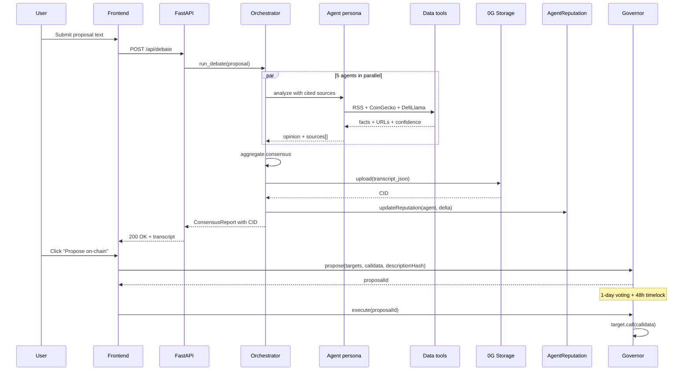
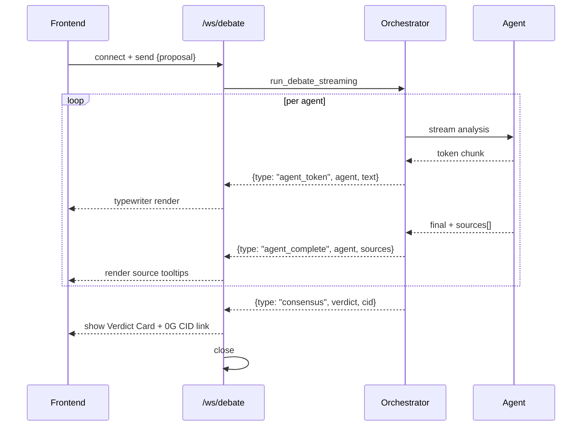
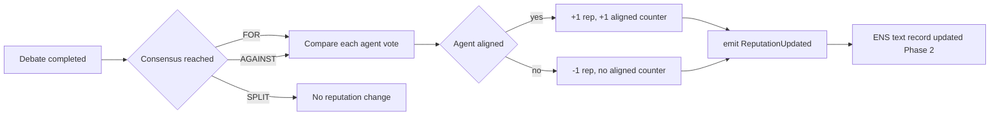

# Architecture

System overview for AI Treasury Council, ETHGlobal Open Agents 2026 submission.

This doc complements [README.md](../README.md). README is the 60-second pitch; this is the implementation reference.

## Layers

| Layer | Stack | Owner | Status |
|-------|-------|-------|--------|
| Frontend | Next.js 16, Tailwind v4, shadcn/ui, RainbowKit, wagmi v2, viem | `apps/web/` | Phase 0+0.5 done, Phase 1B (CONCLAVE dashboard, wagmi flows) in flight on `feat/wagmi-ui` |
| Backend API | Python 3.11, FastAPI, Pydantic v2, structlog, slowapi rate limit | `apps/api/` | 100/100 tests pass, rate-limited, source attribution wired |
| AI agents | Anthropic SDK with prompt caching, async generator streaming | `apps/api/agents/` | Bull live with sources, 4 mock placeholders |
| Storage | 0G Storage via JSON-RPC + IPFS Pinata fallback (factory pattern) | `apps/api/storage/` | Wired |
| Data | RSS (Reuters, CoinDesk), CoinGecko, DefiLlama, DataAggregator | `apps/api/data/` | Wired into Bull pre-fetch |
| Smart contracts | Solidity 0.8.24, Foundry, OpenZeppelin Contracts v5 | `contracts/` | 5 contracts deployed + verified on Base Sepolia |

## High-level flow



## Debate sequence

User submits a proposal. The orchestrator runs five agent personas in parallel, collects sources, computes consensus, persists the transcript, and updates per-agent reputation on-chain.



## WebSocket streaming flow

Live debate UI streams agent reasoning chunk-by-chunk via WebSocket. The backend uses an async generator that yields tokens as Anthropic returns them, plus structured events at agent boundaries.



Frontend uses native `WebSocket` with auto-reconnect and exponential backoff. No external library needed. Hugo Phase 1B pattern.

## AgentReputation Moat 5 flow

Each of the 5 agent personas has an on-chain reputation score. After each debate, the orchestrator credits agents whose vote aligned with the final consensus and decrements those who dissented. Reputation is permissioned (only `authorizedUpdater` backend wallet can write) and fully transparent (every change emits `ReputationUpdated`).



Contract address (Base Sepolia): [`0xf3BAb9A2761131f4A9e5BA2d9e6395bea2186f44`](https://sepolia.basescan.org/address/0xf3BAb9A2761131f4A9e5BA2d9e6395bea2186f44).

Public reads: `reputation(agent)`, `debatesParticipated(agent)`, `alignedWithConsensus(agent)`.

## Phase 2 ENS integration (coming)

Each agent receives a NameStone-managed subname under `aicouncil.eth` with text records updated from the AgentReputation contract:

```
bull.aicouncil.eth
  text aicouncil.role        -> "Growth optimist"
  text aicouncil.reputation  -> "104"
  text aicouncil.aligned     -> "47"
  text aicouncil.debates     -> "52"
  text erc8004.profile       -> JSON blob (forward-compat)
```

Resolution path: Frontend `ENSCard` -> `viem.getEnsText({ name, key })` -> displays badge in CONCLAVE dashboard.

## On-chain components

| Contract | Address | Role | Sora trust mech |
|----------|---------|------|-----------------|
| CouncilToken | [`0x5fE2...4381`](https://sepolia.basescan.org/address/0x5fE2a5E971d9FAafF9cC0b0C9981da44fefC4381) | ERC20Votes governance token, 5 minted, timestamp clock | n/a |
| TimelockController | [`0x76A6...1B0f`](https://sepolia.basescan.org/address/0x76A69Bb6aeF69A2E76fA6C9632Ff6Ca101441B0f) | 48h delay, admin revoked | #2 Timelock countdown |
| AICouncilGovernor | [`0x1f95...01F0`](https://sepolia.basescan.org/address/0x1f95C796C5dc47d08B20CF3220a2AFa995e301F0) | 60% quorum, 1d voting, 0 threshold | n/a |
| MockUSDC | [`0x606E...Bb59d`](https://sepolia.basescan.org/address/0x606EDE7755131e6206A29B67d88761eEbb3Bb59d) | Treasury asset, 1M mUSDC | n/a |
| AgentReputation | [`0xf3BA...6f44`](https://sepolia.basescan.org/address/0xf3BAb9A2761131f4A9e5BA2d9e6395bea2186f44) | Moat 5 PoW for agents | #4 ENS reputation |

Pre-deploy security audit: 0 CRITICAL, 0 HIGH (Mateusz T3, Sesja 16 + Sesja 19).

## Key architectural decisions

ADRs in `dev-team/decisions/`:

- **ADR-001 cut CrewAI** in favor of bare Anthropic SDK with prompt caching (lower latency, full control over streaming)
- **ADR-002 custom i18n provider** instead of next-intl (Turbopack + pnpm + Next 16 conflict)
- **ADR-003 worktree per agent** (parallel sessions without rebase hell)
- **ADR-004 Moat 5 PoW exception** (custom contract beyond OpenZeppelin Wizard scope, justified by ENS reputation Phase 2)

## Repo layout

```
ai-treasury-council/
  apps/
    web/              Next.js 16 frontend, MOCKUPS.md, components, hooks
    api/              FastAPI backend, agents, tools, storage
  contracts/          Foundry, OZ Contracts v5, deployments/base-sepolia.json
  docs/               This folder, README links here
  scripts/            setup-dev.sh, deployment scripts
  tests/              Quill e2e + integration
  dev-team/           Charter, ADRs, handoffs, risk register
```

## Performance budget

- Debate latency: target <30s end-to-end (5 agents parallel + 0G upload)
- WebSocket: target <500ms first token
- Smart contract gas: deploy cost ~10.5M gas total (~$0.0001 on Base Sepolia)
- Backend rate limit: 10 req/min per IP on `/api/debate`

## Observability

- Backend: structlog JSON to stdout, Railway captures logs
- Smart contracts: every state change emits an event (Charter #6 No silent failures)
- Frontend: Sentry placeholder for Phase 4
